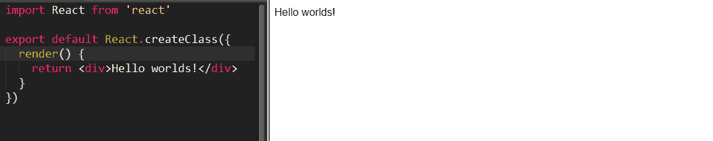

# DEPRECATED

If you want to quickly prototype React apps without setting up a project, try [nwb](https://github.com/insin/nwb)'s `react` command instead.

If you want something to tweak and iterate on React components, try [Carte Blanche](https://github.com/carteb/carte-blanche), [Cosmos](https://github.com/skidding/cosmos) or [React Storybook](https://github.com/kadirahq/react-storybook)

---

# react-heatpack


[![npm package][npm-badge]][npm]

A `heatpack` command for quick [React](https://facebook.github.io/react/) development with [webpack](https://webpack.github.io/) hot reloading.

## Usage

Install the `heatpack` command globally:

```
npm install -g react-heatpack
```

Call `heatpack` with the path to a module which either:

* runs `ReactDOM.render(...)`,
* exports a single React component,
* or exports a React element (e.g. `module.exports = <div></div>`)

For example:

```
$ cat > index.js
import React from 'react'

export default React.createClass({
  render() {
    return <div>Hello worlds!</div>
  }
})

$ heatpack index.js
react-heatpack listening at localhost:3000
webpack built d32ba06f966491387326 in 2075ms
```

Open http://localhost:3000/ and your app will be served and will be hot reloaded with any changes you make.

"Hello worlds!"? Let's fix that typo:



Syntax errors or errors in `render()` methods will be displayed on the screen.

### Use cases

* Quick development and experimentation without the inertia of having to create config files and configure development dependencies up-front.

* Creating [Gists](https://gist.github.com/) which can be cloned, `npm install`ed and `npm start`ed when you want to share code, instead of having to create and host a static build, e.g. [React Form Play](https://gist.github.com/insin/49040037bbb6cd99faf7)

## Configured loaders

Webpack loaders are configured for the following:

### JavaScript

JavaScript modules can have `.js` or `.jsx` extensions and will be transformed with [Babel](http://babeljs.io) (version 5), so you can use:

* [JSX](http://facebook.github.io/react/docs/jsx-in-depth.html)
* [ECMAScript 6 features](https://web.archive.org/web/20150910124138/http://babeljs.io/docs/learn-es2015/#ecmascript-6-features)
* [ECMAScript 7 proposals](https://web.archive.org/web/20150910174653/https://babeljs.io/docs/usage/experimental/) experimentally supported by Babel 5.

You can also require `.json` files as normal.

### CSS

Require CSS files from your JavaScript as if they were any other module, e.g.:

```javascript
require('./Widget.css')
```

Styles will be automatically applied to the page and hot reloaded when you make a change.

Vendor prefixes will be automatically applied to your CSS, as necessary.

Images and font files referenced from your CSS will also be handled for you.

See the [css-loader documentation](https://github.com/webpack/css-loader) for more information on what webpack allows you to do when you start using `require()` for CSS.

### Images

Require image files from your JavaScript as if they were any other module, e.g.:

```html

```

Small images will be inlined as `data:` URIs and larger images will be served up by webpack.

## Gotcha avoidance

### Root element

Since [you should never render to `document.body`](https://medium.com/@dan_abramov/two-weird-tricks-that-fix-react-7cf9bbdef375#486f), the page served up by heatpack includes a `<div id="app"></div>` element for your app to render into.

## Tips & tricks

### Single-file hot reloading with multiple components

If you define and render a bunch of React components in the same module, they can still be hot reloaded.

This can be handy for quickly hacking together something which needs multiple components without having to create separate modules for them:

```js
var React = require('react')
var ReactDOM = require('react-dom')

var App = React.createClass({
  render() {
    return <div><Menu/><Content/></div>
  }
})
var Menu = React.createClass({
  render() {
    return <nav><ul><li>Item</li></ul></nav>
  }
})
var Content = React.createClass({
  render() {
    return <section><h1>Content</h1></section>
  }
})

ReactDOM.render(<App/>, document.querySelector('#app'))
```

### Heatpack in a Tweet

```
cat << ^D > index.js
import React from 'react'
export default () => <div>#reactjs</div>
^D
npm install -g react-heatpack
heatpack index.js

```

## Beyond heatpack

Check out [rwb: the React workbench](https://github.com/petehunt/rwb), which serves and creates production builds for React apps without having to set up your own build tools.

Alternatively if you want set up your own webpack config for a production build, these resources should be useful:

* [petehunt/webpack-howto](https://github.com/petehunt/webpack-howto) is a great place to start for the most common "How do I configure X?" questions about webpack.

* [cesarandreu/web-app](https://github.com/cesarandreu/web-app) describes itself as a "reasonable starting point for building a web app" - as such, it probably doesn't have everything you'll end up needing, but it's a working out-of-the-box example of building for dev, test and production, with meticulously-commented webpack config which links out to relevant documentation and other resources.

* [SurviveJS - Webpack and React](http://survivejs.com/) - while this entire book is a useful reference for working with React and webpack, the [Deploying Applications](http://survivejs.com/webpack_react/deploying_applications/) chapter is of particular interest for putting together a production build.

## MIT Licensed

[npm-badge]: https://img.shields.io/npm/v/react-heatpack.svg
[npm]: https://www.npmjs.org/package/react-heatpack
